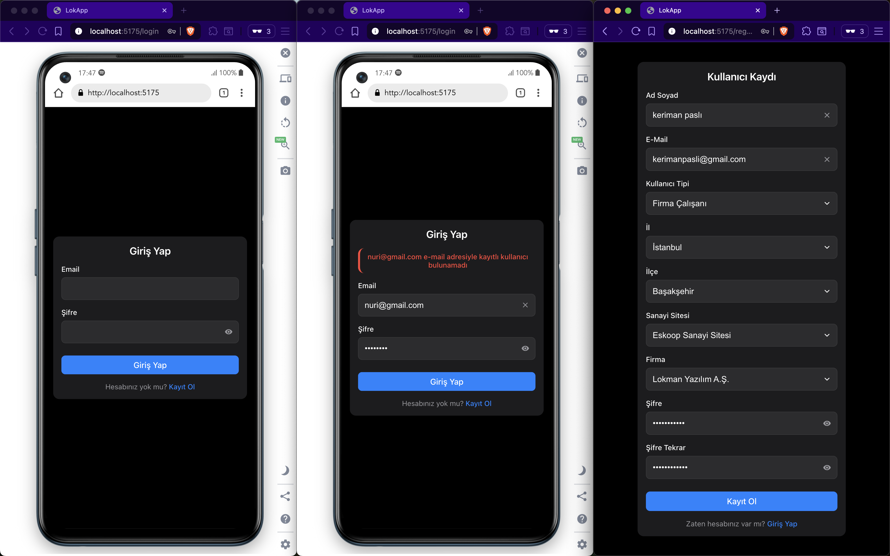
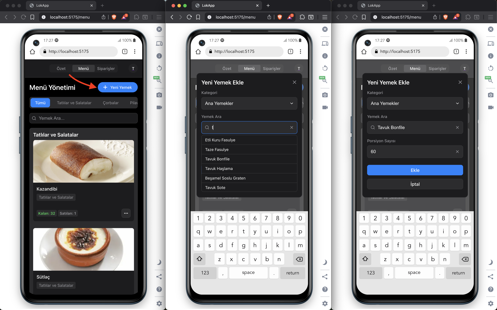
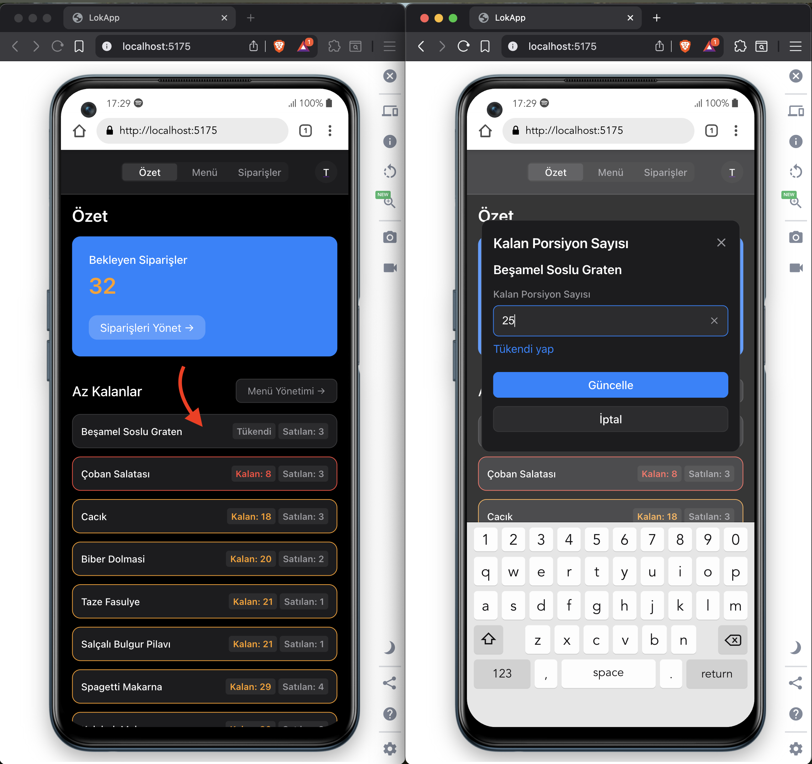
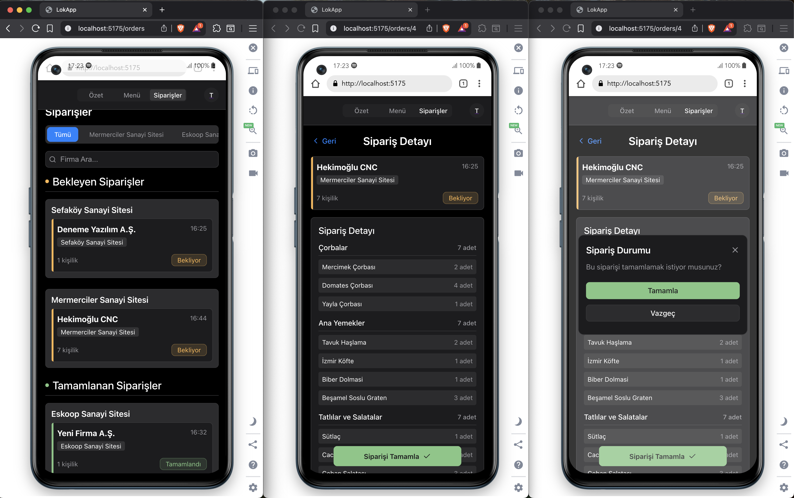
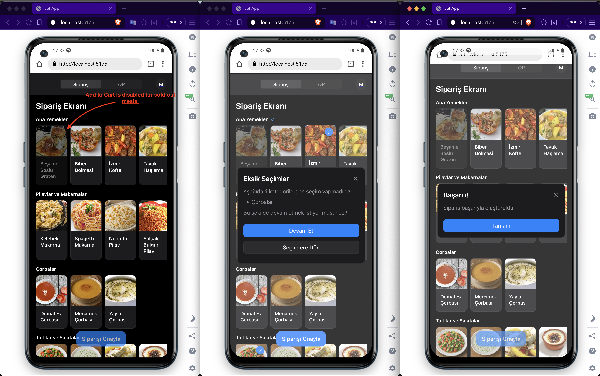
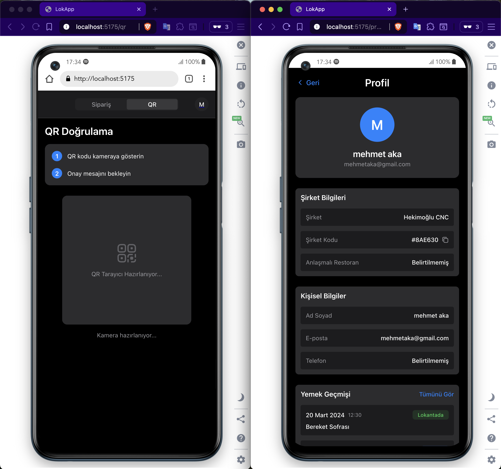
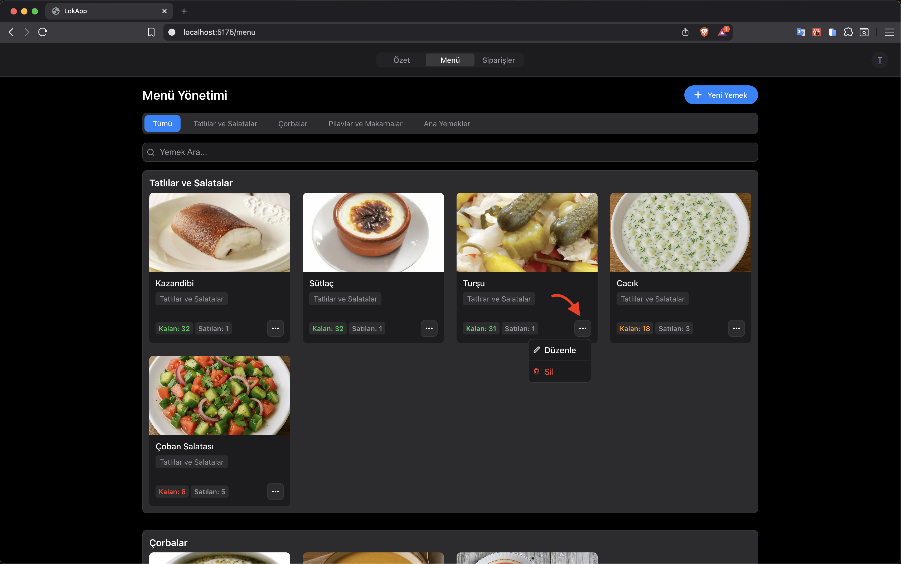
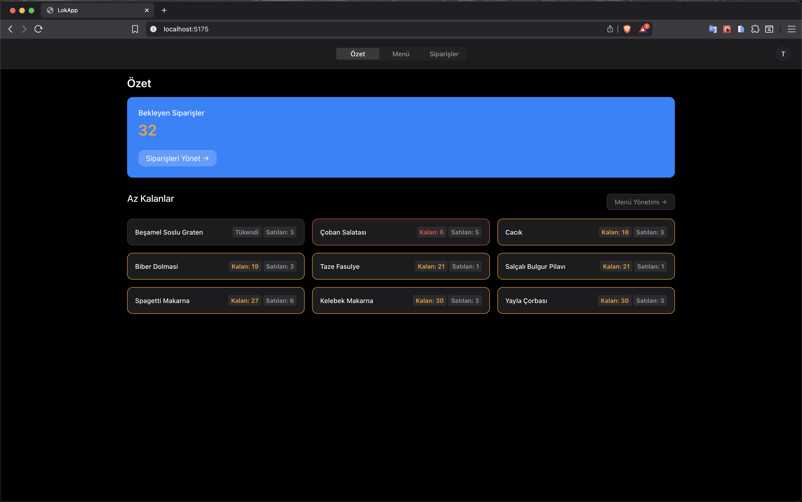
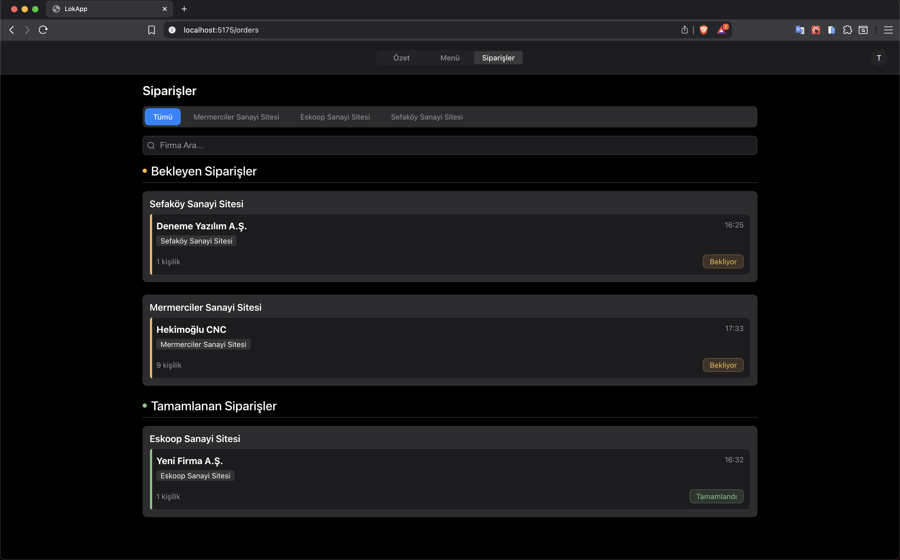
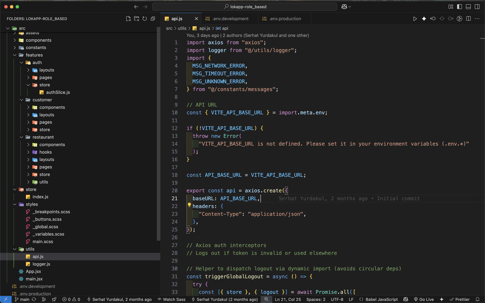

## LokApp

B2B meal ordering for industrial restaurants; ends WhatsApp/meal ticket chaos, standardizes operations, adds stock tracking and transparent billing foundations.

### About this repo

- This repository is for showcase only. The application code lives in a private repository.
- Below you can find product screenshots and brief descriptions of the main flows.

## Demo Video

- YouTube (Unlisted): [Demo Video](https://www.youtube.com/watch?v=0OZnB6jDBDI)

## Live Demo & Demo Accounts

Live Demo (Vercel): [Open App](https://lokapp-role-based-serhatyurdakuls-projects.vercel.app/)

These accounts are for demo purposes only and may be reset periodically.

- Restaurant

  - Email: `testloksorumlu@gmail.com`
  - Password: `test1234`

- Customer
  - Email: `mehmetaka@gmail.com`
  - Password: `12345678`

## Features

- **Role‑based access**: Restaurant and Customer views with protected routes.
- **Company‑grouped kitchen view**: Orders aggregated per company for faster preparation.
- **Stock‑aware menu**: Sold‑out items are disabled for selection.
- **Mobile‑first UI**: Smooth experience on small screens.
- **Standardized flow**: Reduces WhatsApp/meal ticket chaos and provides clear prep summaries.
- QR check‑in and reporting are on the roadmap.

## Tech & Architecture (code‑free overview)

- Frontend: React 18, Redux Toolkit, React Router DOM 6, Axios, SCSS, Vite, SVGR
- Architecture: Feature‑based modules (auth, customer, restaurant), shared UI in `components/common`, centralized state in `store`
- Authorization: Protected routes (`PrivateRoute`), role‑based layouts (Customer / Restaurant), role‑aware rendering
- State: RTK slices (`auth`, `customerMenu`, `restaurantMenu`, `restaurantOrders`, `restaurantInfo`) and memoized selectors
- API layer: Axios instance + interceptors (auth headers with `Authorization` and `uniqueId`; global logout on 401/tokenError; user‑friendly errors)
- UX: Mobile‑first; stock‑aware components; company‑grouped kitchen view; one‑choice‑per‑category rule

## Folder Structure (high‑level) / Klasör Yapısı (özet)

Code lives in a private repository. High‑level overview of the structure:

```
src/
  components/
    common/            # Shared UI components (Button, Modal, Loading, etc.)
  features/
    auth/              # Authentication & role flow
    customer/          # Employee-facing screens & state
    restaurant/        # Restaurant dashboard, menu, orders & state
  store/               # Redux store (root reducer)
  utils/               # API layer (axios + interceptors), helpers
  styles/              # Global SCSS
```

## Ekran Görüntüleri / Screenshots – Mobile Views

<figure>
  
  <figcaption>
    <strong>Login / Register</strong><br/>
    Login/Register: field‑level validation with inline error (e.g., invalid email); password visibility toggle; registration includes employee type and city/district/industrial‑site/company selectors; role‑based redirect after login.
  </figcaption>
  </figure>

<hr/>

<figure>
  
  <figcaption>
    <strong>Restaurant – Menu Management & Add Meal</strong><br/>
    Menu Management: category tabs and search; meal cards with Remaining/Sold badges and “…” action menu (Edit/Delete). "New Meal" button and "Add Meal" modal with Category, type‑ahead search, and Portion Quantity.
  </figcaption>
</figure>

<hr/>

<figure>
  
  <figcaption>
    <strong>Restaurant – Dashboard & Low Stock / Stock Update</strong><br/>
    Dashboard: "Pending Orders" card (CTA: Manage Orders) and "Low Stock" list with per‑meal Remaining/Sold badges and Sold‑Out tag. Right: stock update modal with "Remaining Portions", quick "Mark as Sold Out" and "Update" action.
  </figcaption>
</figure>

<hr/>

<figure>
  
  <figcaption>
    <strong>Restaurant – Orders & Order Detail</strong><br/>
    Orders: industrial‑site tabs and search; company cards “Pending/Completed”. Order Detail: per‑category/meal quantity summary with “Complete Order” button; confirmation modal finalizes the status update.
  </figcaption>
</figure>

<hr/>

<figure>
  
  <figcaption>
    <strong>Customer – Menu (mobile)</strong><br/>
    Mobile ordering: one choice per category; sold‑out disabled; sticky "Confirm Order" button.
  </figcaption>
</figure>

<hr/>

<figure>
  
  <figcaption>
    <strong>Customer – QR & Profile</strong><br/>
    QR verification: dine‑in check‑in flow (camera preparing). Profile: company info, company code, contracted restaurant field, and meal history link.
  </figcaption>
</figure>

<hr/>

### Desktop Görünümleri / Desktop Views (responsive layouts)

<figure>
  
  <figcaption>
    <strong>Restaurant – Menu Management (desktop)</strong><br/>
    Category tabs and search; cards show Remaining/Sold badges; “…” action menu (Edit/Delete).
  </figcaption>
</figure>

<hr/>

<figure>
  
  <figcaption>
    <strong>Restaurant – Dashboard (desktop)</strong><br/>
    "Pending Orders" card and "Low Stock" chips (Remaining/Sold, Sold‑Out); "Menu Management" shortcut.
  </figcaption>
</figure>

<hr/>
<figure>
  
  <figcaption>
    <strong>Restaurant – Orders list (desktop)</strong><br/>
    Industrial‑site tabs and search; Pending/Completed sections with company cards.
  </figcaption>
</figure>

<hr/>

<figure>
  
  <figcaption>
    <strong>Customer – Desktop ordering</strong><br/>
    Desktop ordering — category sections and large card grid; sticky "Confirm Order" button with horizontal‑scroll rows.
  </figcaption>
</figure>

<hr/>

<figure>
  
  <figcaption>
    <strong>Architecture</strong><br/>
    Feature‑based structure, protected routes and API layer overview.
  </figcaption>
</figure>

## Roadmap

- QR check‑in integration and reporting (daily/monthly company totals)
