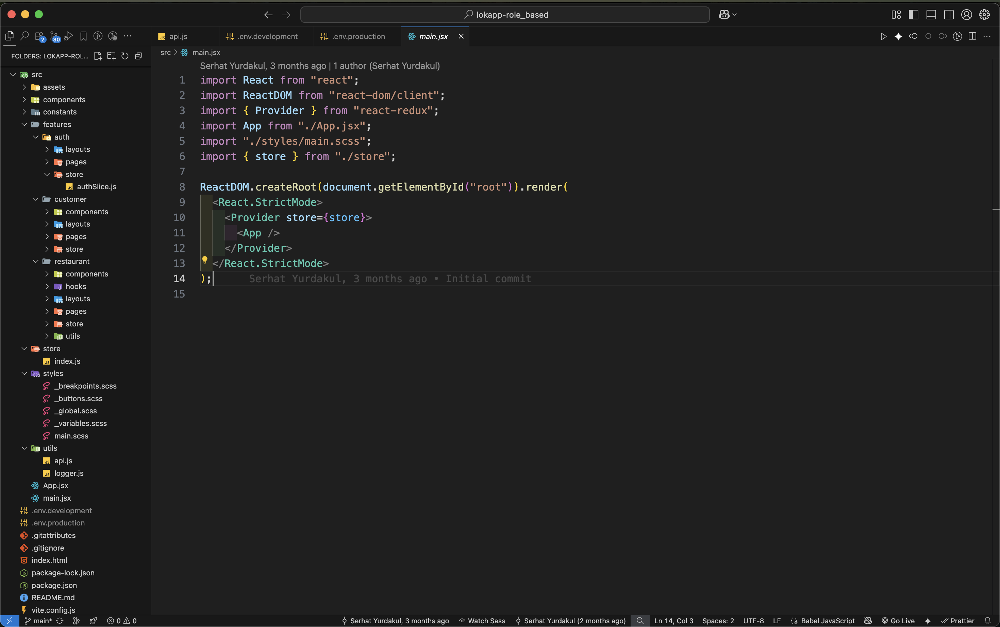

# LokApp

B2B meal ordering for industrial-zone restaurants. Replaces unstructured WhatsApp orders and paper meal tickets with standardized flows, dynamic stock tracking, and transparent billing.

## Quick Start
- Live demo: [Open the app](https://lokapp-role-based-serhatyurdakuls-projects.vercel.app)
- Demo video: [Watch on YouTube](https://youtu.be/0OZnB6jDBDI)

**Demo accounts** *(reset periodically)*
- **Restaurant** — Email: `testloksorumlu@gmail.com` · Password: `test1234`
- **Customer** — Email: `mehmetaka@gmail.com` · Password: `12345678`

> This repository is for showcase only; the application code lives in a private repository. Below are product screenshots and brief explanations of the main flows.

## Features
- **Role-based access**: Restaurant and Customer views with protected routes.
- **Company-grouped kitchen view**: Orders aggregated per company for faster prep and clear summaries.
- **Stock-aware menu**: Sold-out items disabled; one choice per category.
- **Mobile-first UI**: Responsive layouts for small and large screens.
- **Transparent billing**: Clear per-company order summaries support restaurant and company reconciliation.

## Tech Stack & Architecture
- **Frontend:** React, Redux Toolkit, React Router DOM, SCSS
- **API layer:** Centralized HTTP client with auth headers and 401 handling
- **Architecture:** Feature-based modules (auth, customer, restaurant), shared UI in `components/common`, centralized state in `store`

## Folder Structure (overview)

```
src/
  components/
    common/            # Shared UI components (Button, Modal, Loading, etc.)
  features/
    auth/              # Authentication & role flow
    customer/          # Employee-facing screens & state
    restaurant/        # Restaurant dashboard, menu, orders & state
  store/               # Redux store (root reducer)
  utils/               # API layer (axios + interceptors), helpers
  styles/              # Global SCSS
```

## Screenshots - Mobile Views
<figure>
  <figcaption>
    <strong>Login / Register</strong><br/>
    Field-level validation with inline errors (e.g., invalid email), password visibility toggle, registration with employee type and city/district/industrial-site/company selectors, and role-based redirect after login.
  </figcaption>
  
</figure>

<hr/>

<figure>
  <figcaption>
    <strong>Restaurant - Menu Management & Add Meal</strong><br/>
    Category tabs and search; meal cards with Remaining/Sold badges and "..." action menu (Edit/Delete). "New Meal" button and "Add Meal" modal with Category, type-ahead search, and Portion Quantity.
  </figcaption>
  
</figure>

<hr/>


<figure>
  <figcaption>
    <strong>Restaurant - Dashboard & Low Stock / Stock Update</strong><br/>
    "Pending Orders" card (CTA: Manage Orders) and "Low Stock" list with per-meal Remaining/Sold badges and Sold-Out tag. Right: stock update modal with "Remaining Portions", quick "Mark as Sold Out" and "Update" actions.
  </figcaption>
  
</figure>

<hr/>


<figure>
  <figcaption>
    <strong>Restaurant - Orders & Order Detail</strong><br/>
    Orders: industrial-site tabs and search; company cards with Pending/Completed. Order Detail: per-category/meal quantity summary and "Complete Order" button; confirmation modal finalizes the status update.
  </figcaption>
  
</figure>

<hr/>


<figure>
  <figcaption>
    <strong>Customer - Menu (mobile)</strong><br/>
    One choice per category; sold-out disabled; sticky "Confirm Order" button.
  </figcaption>
  
</figure>

<hr/>


<figure>
  <figcaption>
    <strong>Customer - QR & Profile</strong><br/>
    QR verification: dine-in check-in flow (camera preparing). Profile: company info, company code, contracted restaurant, and meal history link.
  </figcaption>
  
</figure>

### Screenshots - Desktop Views

<figure>
  <figcaption>
    <strong>Restaurant - Menu Management (desktop)</strong><br/>
    Category tabs and search; cards show Remaining/Sold badges; "..." action menu (Edit/Delete).
  </figcaption>
  
</figure>

<hr/>


<figure>
  <figcaption>
    <strong>Restaurant - Dashboard (desktop)</strong><br/>
    "Pending Orders" card and "Low Stock" chips (Remaining/Sold, Sold-Out); "Menu Management" shortcut.
  </figcaption>
  
</figure>

<hr/>


<figure>
  <figcaption>
    <strong>Restaurant - Orders list (desktop)</strong><br/>
    Industrial-site tabs and search; Pending/Completed sections with company cards.
  </figcaption>
  
</figure>

<hr/>

<figure>
  <figcaption>
    <strong>Customer - Desktop ordering</strong><br/>
    Category sections and large card grid; sticky "Confirm Order" button with horizontal-scroll rows.
  </figcaption>
  
</figure>

<hr/>


<figure>
  <figcaption>
    <strong>Architecture</strong><br/>
    Feature-based structure; protected routes; API layer overview.
  </figcaption>
  
</figure>

## Roadmap

- QR check-in integration and reporting (daily/monthly company totals)"""
